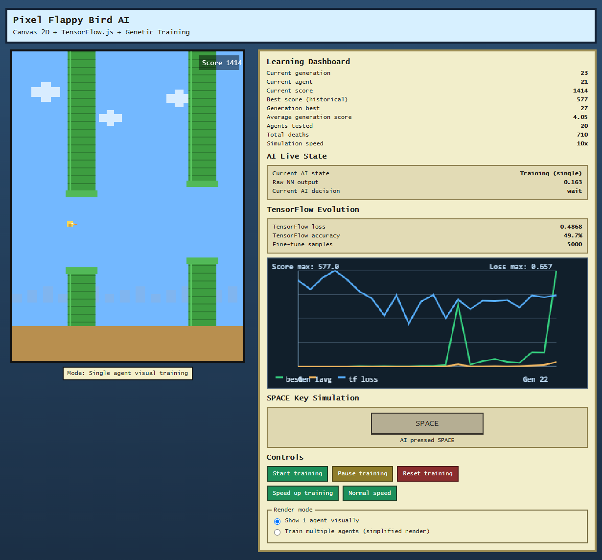
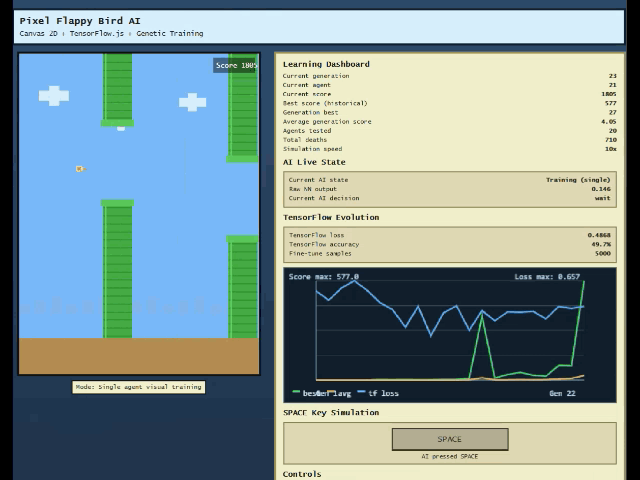

# Pixel Flappy Bird AI

> A retro pixel-art Flappy Bird simulation where a browser-based AI learns to survive pipes with Canvas 2D, TensorFlow.js, and genetic training.

## Project Snapshot

| Item | Details |
| --- | --- |
| App type | Browser game and AI training visualizer |
| Rendering | HTML Canvas 2D pixel-art scene |
| AI runtime | TensorFlow.js loaded in the browser |
| Training style | Genetic population training plus TensorFlow fine-tuning |
| Local server | Node.js static file server |
| Package managers | `pnpm` or `npm` |
| Node.js | `>=18` recommended, tested with `v22.21.1` |

## Demo



The demo screen is split into two main areas:

- **Game canvas**: renders the bird, pipes, score, ground, clouds, and the currently observed agent.
- **Learning dashboard**: shows generation progress, current agent, current score, best scores, average generation score, deaths, and simulation speed.
- **AI live state**: exposes the current training state, raw neural-network output, and whether the AI decided to `jump` or `wait`.
- **TensorFlow evolution**: tracks fine-tuning loss, accuracy, sample count, and the historical evolution chart.
- **SPACE key simulation**: visually indicates when the AI would press SPACE to flap.
- **Controls**: starts, pauses, resets, speeds up, normalizes speed, and changes render mode.

## Training In Motion



The GIF demonstrates the training loop in action:

- Each agent observes the game state and produces a neural-network output between `0` and `1`.
- Outputs greater than or equal to `0.5` trigger a jump; lower values make the bird wait.
- The app records each agent's state/action experiences while it plays.
- When agents die, their fitness is calculated from survival time and pipe score.
- At the end of a generation, the strongest agents influence the next population.
- TensorFlow fine-tuning uses the best collected experiences to improve the mentor model before crossover and mutation create new agents.

## Features

- **Pixel-art Flappy Bird clone** built with Canvas 2D and custom-drawn sprites.
- **Neural-network controlled bird** using TensorFlow.js directly in the browser.
- **Genetic algorithm loop** with population scoring, elite retention, crossover, and mutation.
- **Fine-tuning step** with `model.fit()` using experiences collected from top agents.
- **Live training dashboard** with generation, score, deaths, speed, AI decision, and TensorFlow metrics.
- **Evolution chart** for best score, average score, and TensorFlow loss across generations.
- **Single-agent visual mode** for easier observation.
- **Batch training mode** for faster multi-agent simulation with simplified rendering.
- **Zero backend framework**: Node.js only serves static files locally

## How The AI Works

The bird brain receives five normalized inputs from the game:

| Input | Meaning |
| --- | --- |
| `birdY` | Bird vertical position inside the playable area |
| `velocityY` | Current vertical velocity |
| `distanceX` | Horizontal distance to the next pipe |
| `gapTop` | Top edge of the next pipe gap |
| `gapBottom` | Bottom edge of the next pipe gap |

The TensorFlow.js model is a small dense neural network:

```text
5 inputs -> Dense(8, relu) -> Dense(6, relu) -> Dense(1, sigmoid)
```

The final sigmoid output is interpreted as the flap decision:

```text
output >= 0.5 => jump
output <  0.5 => wait
```

Current training defaults:

| Setting | Value |
| --- | --- |
| Population size | `30` agents |
| Elite agents kept | `4` |
| Mutation rate | `0.12` |
| Mutation amount | `0.32` |
| Fitness formula | `score * 160 + frames survived` |
| Fine-tune epochs | `4` |
| Fine-tune batch size | `64` |
| Fine-tune elite sample source | Top `6` agents |
| Max fine-tune samples | `5000` |
| Max simulation speed | `12x` |

## Tech Stack

- **HTML5** for the page structure.
- **CSS3** for the retro dashboard layout and responsive styling.
- **JavaScript ES Modules** for game, AI, UI, and training logic.
- **Canvas 2D API** for all rendering.
- **TensorFlow.js `4.22.0`** from CDN for model prediction, crossover, mutation, and fine-tuning.
- **Node.js** for the local static server.
- **pnpm or npm** for script execution.

## Requirements

- Node.js `18` or newer.
- A modern browser with ES module support.
- Internet access on first load if TensorFlow.js is not already cached, because it is loaded from:

```html
https://cdn.jsdelivr.net/npm/@tensorflow/tfjs@4.22.0/dist/tf.min.js
```

## Running With pnpm

```bash
pnpm install
pnpm start
```

Then open:

```text
http://localhost:3000
```

## Building Static Assets

```bash
pnpm run build
```

The build script copies `index.html`, `style.css`, `js/`, and `assets/` into `dist/`. The `dist/` directory is generated output and is not committed to the repository.

## Running With npm

```bash
npm install
npm start
```

Then open:

```text
http://localhost:3000
```

The project does not require local runtime dependencies today. The install step is still useful to keep the package-manager workflow consistent and to validate the project metadata.

## Available Scripts

| Command | Description |
| --- | --- |
| `pnpm run build` | Generates the production static files in `dist/` |
| `pnpm start` | Starts the local Node.js static server |
| `pnpm dev` | Same as `start`, useful during development |
| `npm run build` | Generates the production static files in `dist/` |
| `npm start` | Starts the local Node.js static server |
| `npm run dev` | Same as `start`, useful during development |

The server listens on port `3000` by default. You can override it with:

```bash
PORT=4000 npm start
```

## Controls

| Control | Behavior |
| --- | --- |
| `Start training` | Starts or resumes AI simulation |
| `Pause training` | Pauses simulation without clearing progress |
| `Reset training` | Recreates the population and clears historical metrics |
| `Speed up training` | Increases simulation speed up to the configured maximum |
| `Normal speed` | Restores simulation speed to `1x` |
| `Show 1 agent visually` | Runs one visible agent at a time for clear observation |
| `Train multiple agents` | Runs the population faster with simplified rendering |

## Project Structure

```text
.
├── api/
│   └── index.js           # Vercel Function entrypoint
├── assets/
│   └── demo/
│       ├── demo.png        # Main README screenshot
│       └── flap.gif        # Training demonstration GIF
├── js/
│   ├── ai.js               # TensorFlow.js model, prediction, clone, crossover, mutation, training
│   ├── bird.js             # Bird physics, bounds, and pixel rendering
│   ├── evolution-chart.js  # Dashboard chart for score and TensorFlow loss history
│   ├── game.js             # Game loop state, pipes, scoring, collisions, and Canvas drawing
│   ├── main.js             # Browser bootstrap and animation frame loop
│   ├── pipe.js             # Pipe geometry, movement, collision, and rendering
│   ├── training.js         # Population lifecycle, fitness, fine-tuning, and generation evolution
│   └── ui.js               # Dashboard updates, controls, render mode, and SPACE simulation
├── index.html              # App shell and TensorFlow.js CDN script
├── package.json            # Scripts and package metadata
├── pnpm-lock.yaml          # pnpm lockfile
├── scripts/
│   └── build-static.js     # Static production build generator
├── server.js               # Static file handler and local server
├── vercel.json             # Vercel build, function, and rewrite configuration
└── style.css               # Retro dashboard styling
```

## Development Notes

- The app is intentionally client-side: training runs in the browser, not in Node.js.
- TensorFlow tensors are wrapped with `tf.tidy()` or disposed after training datasets are used to reduce memory growth.
- Canvas image smoothing is disabled to preserve the pixel-art look.
- Batch mode prioritizes training speed over visual detail.
- The static server sets `Cache-Control: no-store` so changes are easier to test while developing.
- In production, `api/index.js` serves only files generated into `dist/`; run `pnpm run build` before testing the serverless handler locally.

## Troubleshooting

| Problem | Fix |
| --- | --- |
| TensorFlow.js does not load | Check internet access and the CDN script in `index.html`. |
| Browser shows a blank page | Open DevTools and check for JavaScript module or CDN loading errors. |
| Port `3000` is already in use | Run with another port, for example `PORT=4000 npm start`. |
| `pnpm` is unavailable | Use `npm start`, or enable Corepack and prepare pnpm for your Node installation. |
| Vercel deploy cannot find files | Confirm the build ran and `dist/index.html`, `dist/style.css`, and `dist/js/main.js` exist. |
| Vercel settings differ from production | Set the framework to `Other`, use `pnpm run build`, output `dist`, and remove the install command override. |
| Training looks slow at first | Use `Speed up training` or switch to batch render mode. Early generations are expected to fail quickly. |

## License

No license file is currently included. Add one before publishing or redistributing this project.
